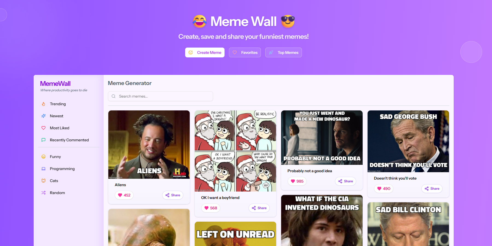
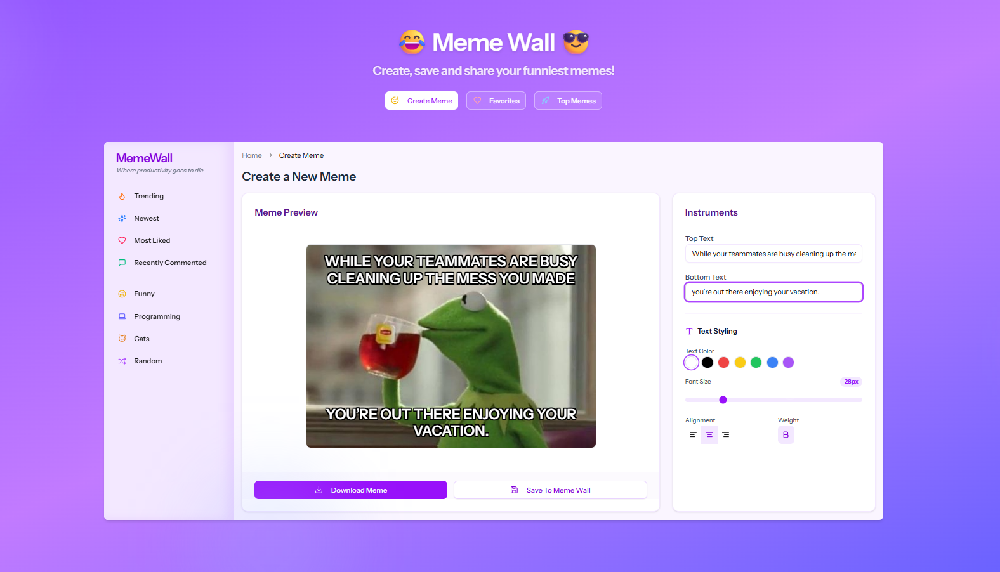

# Memewall

[](https://memewall.fumarov.me)

A Laravel-based application for managing and displaying memes, built with React, Inertia.js, and Tailwind CSS.




## 🚀 Tech Stack

- **Backend:** [Laravel 12](https://laravel.com) (PHP 8.2+)
- **Frontend:** [React 19](https://react.dev), [Inertia.js 2.0](https://inertiajs.com)
- **Styling:** [Tailwind CSS 4.0](https://tailwindcss.com)
- **Language:** [TypeScript](https://www.typescriptlang.org)
- **Build Tool:** [Vite](https://vitejs.dev)
- **Package Managers:** [Composer](https://getcomposer.org) (PHP), [pnpm](https://pnpm.io) (JS)
- **Authentication:** [Laravel Fortify](https://laravel.com/docs/fortify)

## 📋 Requirements

- PHP ^8.2
- Node.js & pnpm
- Composer
- SQLite (default) or other supported database

## 🛠️ Setup & Installation

The project includes a convenient setup script:

```bash
composer setup
```

This command will:
1. Install PHP dependencies.
2. Create `.env` from `.env.example` if it doesn't exist.
3. Generate the application key.
4. Run database migrations.
5. Install Node dependencies.
6. Build the frontend assets.

## 🏃 Running the Application

To start the development environment (Vite + Laravel server + Queue):

```bash
composer dev
```

The application will be available at `http://localhost:8000`.

## 📜 Available Scripts

### Composer Scripts

- `composer setup`: Complete project initialization.
- `composer dev`: Start development servers (Server, Queue, Vite).
- `composer dev:ssr`: Start development servers with SSR support.
- `composer test`: Run PHP tests using Pest.

### NPM/PNPM Scripts

- `pnpm dev`: Start Vite development server.
- `pnpm build`: Build frontend assets for production.
- `pnpm build:ssr`: Build frontend assets for production with SSR.
- `pnpm lint`: Run ESLint.
- `pnpm format`: Format code with Prettier.
- `pnpm types`: Run TypeScript type checking.

## 🔑 Environment Variables

Key variables in `.env`:

- `APP_NAME`: Name of the application.
- `APP_ENV`: Application environment (`local`, `production`, etc.).
- `APP_KEY`: Application encryption key.
- `DB_CONNECTION`: Database connection (default: `sqlite`).
- `QUEUE_CONNECTION`: Queue driver (default: `database`).

Refer to `.env.example` for a full list of available configurations.

## 🧪 Testing

Run the test suite with:

```bash
composer test
```

The project uses [Pest PHP](https://pestphp.com/) for testing.

## 📂 Project Structure

- `app/`: Core Laravel application logic (Controllers, Models, Services).
- `bootstrap/`: Framework bootstrapping.
- `config/`: Application configuration files.
- `database/`: Database migrations, factories, and seeders.
- `public/`: Publicly accessible assets and entry point (`index.php`).
- `resources/js/`: React components and pages.
- `resources/views/`: Blade templates (primarily `app.blade.php` for Inertia).
- `routes/`: Web and API route definitions.
- `tests/`: Automated tests.

## 📄 License

This project is licensed under the [MIT license](composer.json).
